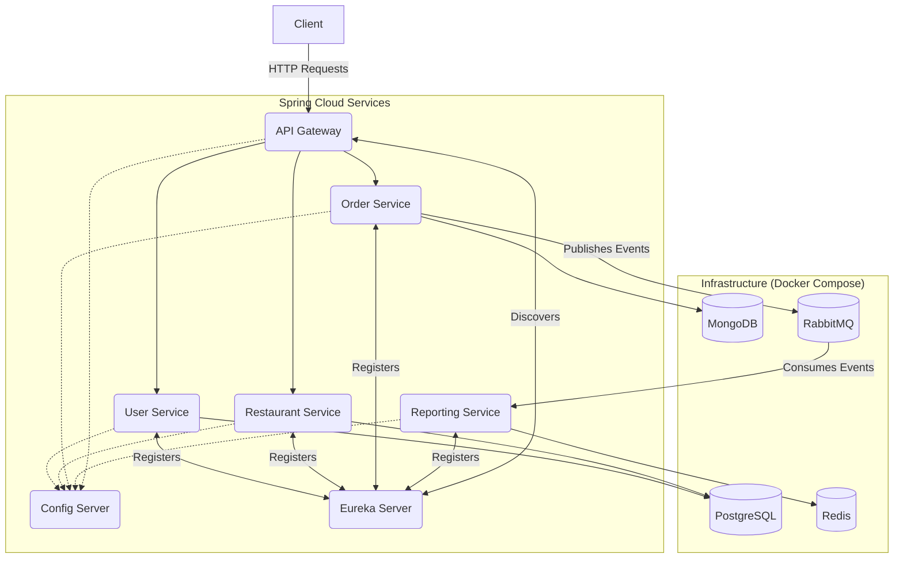

## 🍽️ Restaurant Management System – Microservices Architecture

A modern, cloud-native **Restaurant Management System** built with **Spring Boot Microservices**.  
This project demonstrates real-world enterprise patterns such as centralized configuration, service discovery, API gateway routing, JWT security, asynchronous communication, and containerized deployment.

The goal of this repository is to showcase **clean architecture**, **scalable microservices**, and **production-ready Spring Cloud practices**.

---

## ✨ Key Features

✅ **Microservices-based Design** – Each business domain runs as an independent Spring Boot service  
✅ **Centralized Configuration** – Configuration management via Spring Cloud Config Server  
✅ **Service Discovery** – Dynamic service registration and lookup using Netflix Eureka  
✅ **API Gateway** – Single entry point using Spring Cloud Gateway  
✅ **JWT Authentication & Authorization** – Secure, stateless access control with Spring Security  
✅ **Polyglot Persistence** – PostgreSQL and MongoDB used where appropriate  
✅ **Caching Support** – Redis for fast, read-heavy operations  
✅ **Event-Driven Ready** – Easily extendable with RabbitMQ for async workflows  
✅ **Dockerized Environment** – Entire infrastructure runs via Docker Compose  

---

## 🏛️ System Architecture

All client requests are routed through the **API Gateway**.  
Each service registers with **Eureka** and retrieves configuration from the **Config Server**.




## 🛠️ Technology Stack

| Category | Technologies |
|--------|--------------|
| **Backend** | Java 17, Spring Boot 3.x, Spring Web |
| **Security** | Spring Security, JWT |
| **Spring Cloud** | Config Server, Netflix Eureka, Cloud Gateway, OpenFeign |
| **Databases** | PostgreSQL, MongoDB |
| **Caching** | Redis |
| **Messaging** | RabbitMQ |
| **Containerization** | Docker, Docker Compose |
| **Build Tool** | Apache Maven |

---

## 🚀 Getting Started

Follow these instructions to run the entire microservices ecosystem locally.

### 📌 Prerequisites

Make sure you have the following installed:

- Java JDK 17 or newer
- Apache Maven 3.8+
- Docker & Docker Compose

---

## 🐳 Local Development Environment

All required infrastructure is defined in the `docker-compose.yml` file.

After starting Docker Compose, the following services will be available:

| Service | Port | UI |
|------|------|----|
| PostgreSQL | 5432 | Use pgAdmin |
| MongoDB | 27017 | Mongo Express |
| Redis | 6379 | RedisInsight |
| RabbitMQ | 5672 / 15672 | http://localhost:15672 |

---

## 📋 Step-by-Step Setup

### 1️⃣ Clone the Repository

```bash
git clone https://github.com/arshmed/restraurant-management-system.git
cd restraurant-management-system
```
2️⃣ Build All Services
```bash
mvn clean install
```
3️⃣ Start Infrastructure Services
```bash
docker-compose up -d
```
4️⃣ Run Microservices
```bash
# API Gateway
java -jar gateway-service/target/gateway-service-*.jar

# User Service
java -jar user-service/target/user-service-*.jar

# Restaurant Service
java -jar restaurant-service/target/restaurant-service-*.jar

# Order Service
java -jar order-service/target/order-service-*.jar

# Reporting Service
java -jar reporting-service/target/reporting-service-*.jar
```
🔐 API Usage
All external requests must go through the API Gateway.

Authentication Flow
1. Register

```bash
POST /api/v1/auth/register
```
2. Login

```bash
POST /api/v1/auth/login
```
The response will contain a JWT access token.

Authorized Requests
Include the token in request headers:

```makefile
Authorization: Bearer <your_jwt_token>
```
Example request:

```http
GET /api/v1/orders
Authorization: Bearer <your_jwt_token>
```
